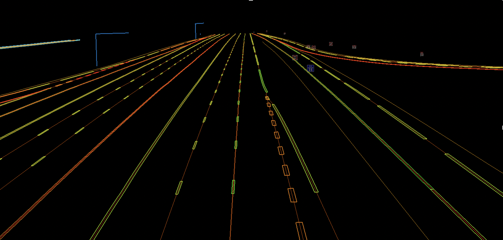

# 高精度地图

随着车路协同、数字孪生、交通仿真、自动驾驶等技术的发展与应用，新生业务形态对空间基础数据的要求在精度、时效性、维度上提出了更高的要求。当前已有的空间基础数据在道路要素的精细度与丰富度方面已不足以满足上述新兴领域的需求。作为基础数字底座，高精度地图应运而生并发挥至关重要的作用，下面对高精度地图进行简要介绍。

### 一、高精度地图的内涵

高精度地图(HD-Map)指精度较高的地图数据，可以提供更精确的地理信息。这种地图数据可以用于智能交通、自动驾驶导航、交通仿真、数字孪生等应用场景，具有重要的实际意义。高精度地图一般是由多种数据源(例如卫星影像、遥感数据、地面测量数据等)经过外业测绘采集、内业数据加工等技术处理而生成的，能够提供更为准确的空间信息。高精度地图具有两个重要特点，一是精度高，绝对精度和相对精度均在分米级的高分辨率，二是要素全面，相比传统或当前精度下的路网，高精度地图所包含的道理信息内容更丰富，刻画的更细致。

从功能上来分，高精度地图一般分为四个层次：高精度几何层、路表层、车道几何拓扑关系层、规则属性层。

* **高精度几何层**：表达道路、车道高精度、详尽的几何、位置信息，该层的特点是精度高、粒度细，主要包含以下要素:车道边线、标志牌、停止线、人行横道、龙门架、红绿灯、车道印刷物、防护栏等。并使用曲率、坡度、航向、横坡等参数去精确定义车道级的几何外观。
* **路表层**：路表信息用于描述路面表面的健康状况，主要包括路面材质、坑洼起伏裂纹、 摩擦系数等。
* **车道几何拓扑关系层**：表达车道级拓扑网络关系，主要包含以下要素：车道中心线、虚拟连接线、车道节点、道路区间、道路向量，以及车道节点间的连接关系。
* **规则属性层：** 表达交通管理信息，主要包括以下要素：车道限速、限高、限行、限号、转向规则等系列信息。

<figure><figcaption>
高精度地图示意
</figcaption></figure>

### 二、高精度地图的作用

基于上述丰富精细的地图信息，高精度地图在多个方面可发挥重要作用，包括但不限于以下方面：

* **自动驾驶：**自动驾驶车辆自带高精度感知设备，如雷达、摄像头等，可实时感知路网及周边动态。然而，当出现感知盲区或感知失效时，如雨雪天气，感知设备效能降低、路面被覆盖等情况，将大大降低自动驾驶的安全性。因此，基于精准的几何、拓扑、路表、规则四大类信息，高精度地图可不受任何特殊情况影响，为自动驾驶车辆提供精准的路网信息，从而提升自动驾驶的安全性。
* **数字孪生：**交通数字孪生的特点在于，构建一比一还原现实的虚拟世界，从而方便使用者高效直观的了解现实世界的路网与交通状态。因此，基于精准的外观信息，可构建高保真的交通数字孪生场景，并确保前端采集的车辆位置数据可在虚拟世界对应位置正确显示，从而确保数字孪生场景的真实性。
* **交通仿真：**交通仿真，尤其是微观交通仿真，旨在借助模型推演交通态势指导进一步决策，输入的参数越精准，则推演的效果越好。与支撑自动驾驶类似，高精度地图提供的道路几何、拓扑、路表、规则丰富路网信息，可用于精准构建仿真所需路网环境，从而提高交通仿真对现实交通刻画的真实度，提高后续决策的合理性与有效性。
* **车路协同：** 实现车路协同的一个重要基础，即感知、认知、决策、协同完整闭环需基于统一且无误的空间基础数据，因此，一套统一精确的高精度地图，可为车路协同提供精度无误的车辆及路网定位，从而为实现二者协同打下坚实基础。

### 三、高精度地图与标精度地图的关系

上述前空间基础数据与高精度地图都用数字化的方式描述路网数据，然而其有各自的特征，并适用于不同的场景，下面就两者的区别与联系做简要介绍。

#### 区别

当前空间基础数据与高精度地图在几个方面有所差异:数据内容、数据组织方式、 定位精度、制作原理、适用场景。

* 数据内容 当前空间基础数据尽可能多地描述了真实世界，如行政区划、湖泊、道路， 以及用于高速业务的路公司、交通管辖范围等内容，以及为路径规划服务的路 网拓扑关系、POI 点位等。而高精度地图更侧重精准描述道路信息，包括道路 几何信息、路表信息等。因此，当前空间基础数据从较为宏观的视角描述真实 世界，而高精度地图从微观角度着重描述道路内部以及周边信息，表达了当前 空间技术数据难以表达的道路内部信息。
* 数据组织方式 当前空间基础数据使用分尺度、分区域、分层次的方法来组织地图要 素，这是面向当前业务需求而设计的，这种组织方法在满足路径规、智能交通 相关算法需求的同时，具备很高的效率。道路是当前在空间基础数据的最细粒 度。对于高精度地图而言，其更多关注于道路内部，因此道路是其数据组织的 最大单元，道路区间、车道、道路附属实施等都关联到道路上; 车道是构成高精 度地图的最小结构化单元。
* &#x20;精度 当前空间基础数据使用一维的线来表示道路，其定位精度一般达到道路级，约 10 米。而高精度地图能够实现车道级精准定位，绝对精度小于 1 米，相对精度 达到分米级。
* 制作原理 当前空间基础数据一般使用 GPS 采集技术，基于 GIS 数据编辑软件，如 QGIS，结合卫星地图对数据进行核验，进一步基于空间计算算法，进一步得到 空间包含、拓扑关系等;高精度地图数据则需要采集激光点云数据，结合人工 智能算法对数据进一步加工处理得到高精度地图数据，基于高精度地图编辑软 件，如 RoadRunner，进一步检查与加工。
* 适用场景 当前空间基础数据已广泛应用于交通调查与分析、交通状态感知、高速计 费等、路径规划业务中，其所需道路精度不高，而更注重宏观要素的全面性，以 及使用与处理的高效性;高精度地图则适用于数字孪生、交通仿真、车路协同、 自动驾驶等对地图要求较高的新兴领域。

#### 联系

高精度地图与当前空间基础数据可互为补充。当前基础数据体系已积累大量带有 业务属性的空间数据，如门架、里程桩、收费站、枢纽、道路编号、路公司范围等，以 及车道限速、限高、限重等业务规则，在制作高精度地图信息时，采集制作的初版地 图不具备上述业务属性，因此，可将高精度地图与当前空间基础数据进行空间关联， 实现相关属性的复用。

此外，对于高精度地图与当前空间基础数据中重合的要素，如门架、里程桩、路 牌等路侧设施，其在高精度地图与当前空间基础数据中，应保持位置、属性一致，确 保数据的一致性。

最后，二者虽适用的主要场景有所区别，然而随着业务智慧化程度的提高，可考 虑使用新兴领域技术为传统的智慧交通领域赋能，例如在主动管控领域，即可借助数 字孪生与交通仿真技术，构建路网与实时交通流，并进行仿真推演，提高决策的有效 性。那么，在上述赋能过程中，则需将传统业务领域与高精度地图相适配，本质上即 实现当前空间基础数据与高精度地图的空间对齐。

### 四、高精度地图制作总体流程

#### 制定高精度地图规范

#### 构建高精度地图质量评价体系

#### 数据采集与制作

#### 建立高精度地图与空间基础数据的匹配关系

#### 制定高精度地图管理与更新方案
