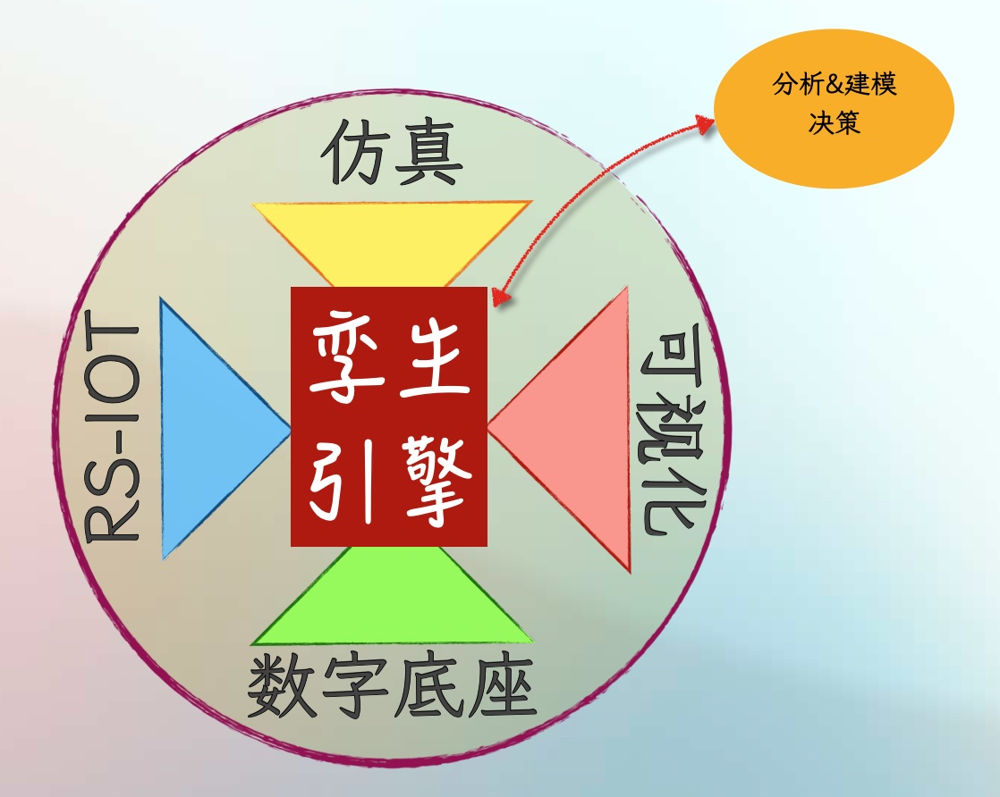

# 交通数字孪生引擎及成熟度

#### 3.1 交通数字孪生引擎

<figure><figcaption></figcaption></figure>

​图3: 交通数字孪生引擎​

若将数字孪生类比为车辆驾驶，驾驶涉及动力控制（油门刹车）、齿轮控制（档位）、转向控制（方向盘）、电子控制（车机系统）四大关键行为，驾驶员需要对其充分掌控并融会贯通灵活使用，并基于周边环境进行**分析**与**实时决策**，方能进行驾驶。交通数字孪生引擎则类似于驾驶员。如图3所示，交通数字孪生主要设计RS-IoT（基于路侧物联网设施的感知数据采集）、数字底座（用于分析计算空间物理场景虚拟化）、仿真（各类算法）、可视化（渲染展示）四大技术栈，交通数字孪生引擎则负责充分灵活调度各技术栈，并需具备**分析与建模**、**决策**能力，从而构建交通数字孪生系统。

下面进一步给出数字孪生相关技术栈（数字底座构建、动态数据采集、分析与建模、仿真推演、决策、孪生可视化）的具体解释。

| 技术栈    | 释义                                                                                      |
| ------ | --------------------------------------------------------------------------------------- |
| 数字底座构建 | 借助空间数据采集手段（点云雷达、倾斜摄影、视屏识别、遥感等），对交通全静态要素进行收集，包括车道中心线、边界线、路肩、护栏、车道线、指示牌、路面状态等             |
| 动态数据采集 | 借助观测手段（相机抓拍、雷达感知、视频识别、感应等），对交通全动态要素进行收集，包括车辆三维、车辆属性、事件、特殊事件、天气等                         |
| 分析与建模  | 结合统计、人工智能等方法，对全要素数据进行分析，得到关键指标，并建立交通流模型（交通流量时空分布、OD规律）、单车模型（车辆行为偏好、车辆轨迹）、天气模型等，用于支撑仿真推演 |
| 仿真推演   | 基于数字底座与动态数据，结合分析建模结果，运用仿真的方式对未来一定时间的交通运行进行推演                                            |
| 决策     | 充分利用人工智能技术，基于仿真推演结果、历史观测、专家经验等数据，针对给定目标（如减少拥堵）进行自动化决策                                   |
| 孪生可视化  | 利用2/2.5/3D渲染等方式，将动、静态全交通要素进行可视化展示                                                       |

​表1: 交通数字孪生应用相关技术栈释义​

#### 3.2 路线图及成熟度模型

3.1节提出交通数字孪生六大技术栈，在具体工程实践中，其往往内在包含递进关系，如施工排期任务，则首先需构造数字底座用于空间计算及可视化，其次需收集海量历史数据，再次基于数据进行分析建模与仿真推演，最后基于推演结果给出排期计划，此外，借助孪生可视化对仿真推演全过程进行展示，方便掌控与理解决策结果。此外，各步骤自身具有成熟度，即实现程度，各步骤的成熟度共同影响交通数字孪生项目的成熟度。因此，下面提出交通数字孪生路线图及成熟度模型。

| 成熟度 \ 路线图 | S1: 数字底座构建 | S2: 动态数据采集 | S3: 分析与建模 | S4: 仿真推演 | S5: 决策  | S6: 孪生可视化 |
| --------- | ---------- | ---------- | --------- | -------- | ------- | --------- |
| L1        | SD         | 低质低覆盖      | 简单交通流模型   | 随机仿真     | 人工决策    | LOD0      |
| L2        | SD+        | 低质高覆盖      | 复杂交通流模型   | 简单参数仿真   | 数据+人工决策 | LOD1      |
| L3        | SD++       | 高质低覆盖      | 简单单车模型    | 定制参数仿真   | 推演+人工决策 | LOD2      |
| L4        | HD         | 高质高覆盖      | 复杂单车模型    | 多场景联合仿真  | 半自主决策   | LOD3      |
| L5        | HD+        | 全要素融合      | 全要素建模     | 完全仿真     | 自主决策    | LOD4      |

​表2: 交通数字孪生路线图及成熟度​

| 成熟度  | 具体解释                                                                |
| ---- | ------------------------------------------------------------------- |
| S1L1 | SD：包含道路路网形状、拓扑等内容，精度在5\~10米左右                                       |
| S1L2 | SD+：包含道路坡度、曲率、简单的车道信息，精度在50厘米                                       |
| S1L3 | SD++：包含了详细的车道属性等，精度在20～50厘米左右                                       |
| S1L4 | HD：包含高精度的车道几何信息、路口表达，限速、虚实线、转向标志等语义信息，精度达到10厘米，对标OpenDrive标准^{\[9]} |
| S1L5 | HD+：在高精度地图的基础上，增加路表模型，包含路面破损、路面颠簸等信息，对标OpenCRG标准 ^{\[10]}           |
| S2L1 | 低质低覆盖：数据质量较低，在准确性、完整性、时效性等方面表现较差，且覆盖的时空范围不完善                        |
| S2L2 | 低质高覆盖：数据质量较低，覆盖的时空范围较为完善                                            |
| S2L3 | 高质底覆盖：数据质量较高，在准确性、完整性、时效性等方面表现较好，但覆盖的时空范围不完善                        |
| S2L4 | 高质高覆盖：数据质量较高，且覆盖时空范围较为完善                                            |
| S2L5 | 全要素融合：高质量采集全时空范围内多源异构数据并进行充分融合                                      |
| S3L1 | 简单交通流模型：对交通流特征进行简单刻画，如包括较粗时间颗粒度的交通量、车型比等                            |
| S3L2 | 复杂交通流建模：对交通流特征刻画较完备，包括较细时间颗粒度的车道级+车型级交通量，车型级OPD等                    |
| S3L3 | 简单单车模型：对单一车辆特征进行简单刻画，包括单一车辆的OPD规律、出行时间特征等                           |
| S3L4 | 复杂单车模型：对单一车辆特征刻画较完备，包括车速便好、车道便好、变道行为编号、急加速/减速便好等                    |
| S3L5 | 全要素建模：对交通流、单一车辆、天气、路损等全要素进行建模                                       |
| S4L1 | 随机仿真：无任何参数设置（如历史流量分布、OD规律等）进行随机仿真推演                                 |
| S4L2 | 简单参数仿真：基于历史数据提取关键参数，包括流量分布、OD规律等进行仿真推演                              |
| S4L3 | 定制参数仿真：基于历史数据提取单一车辆的运行参数，包括单一车辆的驾驶特征（车速、变道等）、OD特征，进行定制化仿真推演         |
| S4L4 | 多场景联合仿真：联动多场景，如事故、火灾、天气等进行仿真推演                                      |
| S4L5 | 完全仿真：结合HD+级别路表信息，充分联动全场景全数据进行仿真推演                                   |
| S5L1 | 人工决策：基于专家经验进行决策                                                     |
| S5L2 | 数据+人工决策：基于数据分析，结合经验进行决策                                             |
| S5L3 | 推演+人工决策：在进行仿真推演的基础上，结合经验进行人工决策                                      |
| S5L4 | 半自主决策：交通数字孪生系统自主推演并给出决策建议，交由人工决策                                    |
| S5L5 | 自主决策：交通数字孪生系统自主推演并充分运用专家经验，无需人工干预完成决策                               |
| S6L1 | LOD0：LOD指Level of Detial，LOD0即最低标准，为2D或2.5D区域级展示，几乎无细节              |
| S6L2 | LOD1：外形特征表现为块级，基本使用方块、菱形等构建交通要素                                     |
| S6L3 | LOD2：道路、建筑物、车辆、植被初步具有定制化外形特征                                        |
| S6L4 | LOD3：交通全要素基本具有高分辨率外形、纹理                                             |
| S6L5 | LOD4：交通全要素1:1完全复刻（此处LOD0～LOD4参考OGC标准^{\[11]}）                       |

​表3: 成熟度释义​

\clubsuit 注：表2、表3中，S1～S6表示Step1～Step6，L1～L5表示Level1～Level5。
