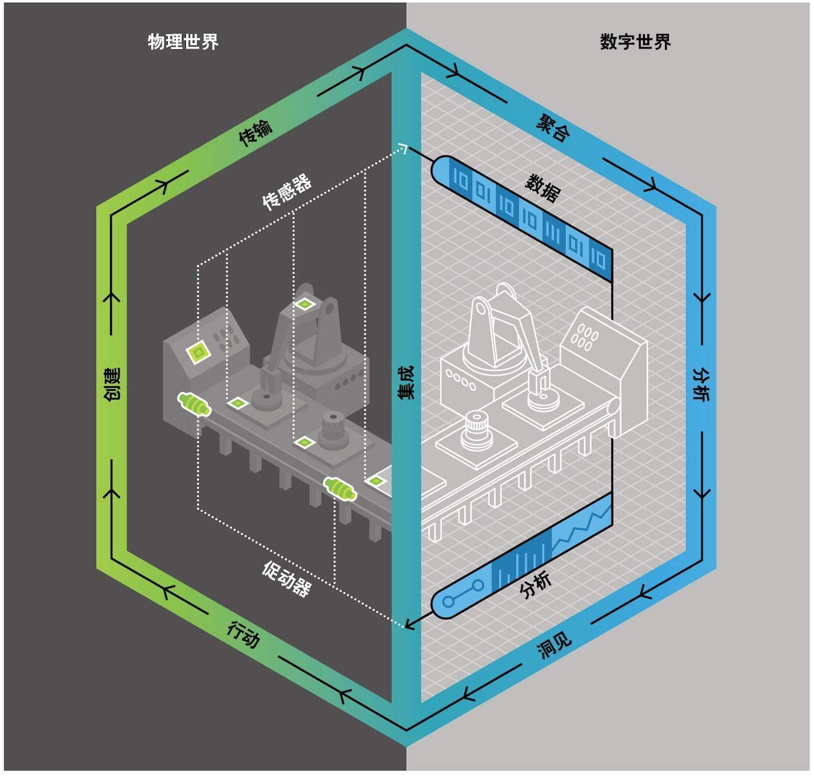

# 交通数字孪生概述

#### 1.1 起源与发展

Grieves 教授于 2002 年在密歇根州特洛伊举行的制造工程师协会会议上首次提出了数字孪生（Digital Twin）的设想，并介绍了概念和模型$^{\[1]}$。Grieves 提出将数字孪生作为产品生命周期管理（PLM）的概念模型$^{\[2]}$。尽管没有正式提出数字孪生这一术语，该设想已体现出物理实体映射至虚拟实体的思想。

$$
f(x) = x * e^{2 pi i \xi x}
$$

2010年，数字孪生一词在美国国家航空航天局（NASA）路线图报告中被正式提出，被定义为“集成了多物理量、多尺度、多概率的系统或飞行器仿真过程”^{\[3]}。随后数字孪生被逐渐应用于军工及航空航天领域，如美国国家航空航天局（NASA）基于数字孪生开展飞行器健康管控^{\[4],\[5]}，洛克希德·马丁公司在生产F35战机过程中引入数字孪生用于优化工艺及设计^{\[6]} 。

近年来，随着德国工业4.0、美国工业互联网、中国制造2025等多个国家发展战略的提出，基于物联网、大数据、云计算、人工智能、新基建等高新信息技术的数字孪生已被广泛接受，并在多个领域逐步落地应用，如智能制造、智能交通、数字医疗、数字城市等。

2021年10月25日，交通运输部印发了《数字交通“十四五”发展规划》，规划确定了十四五期间我国数字交通发展的总体目标、具体目标、建设任务和保障措施，指导了我国数字交通在未来五年中发展，并为交通数字孪生进一步发展奠定了坚实基础。

#### 1.2 概念与内涵

数字孪生术语最初是基于工业设备全生命周期管理场景提出的，美国国防采办大学认为，数字孪生是充分利用物理模型、传感器更新、运行历史等数据，集成多学科、多物理量、多尺度、 多概率的仿真过程，在虚拟空间中完成映射，从而反映相对应的实体装备的全生命周期过程。

随着数字孪生应用的高速发展，其最初的内涵被进一步泛化，如图1^{\[7]}所示，当前数字孪生涉及数据采集与聚合、分析、洞见（预测）等多个方面。林诗万博士认为，数字孪生是实体或逻辑对象在数字空间的全生命周期的动态复制体，可基于丰富的历史和实时数据、先进的算法模型实现对对象状态和行为高保真度的数字化表征、模拟试验和预测。陶飞教授认为，数字孪生以数字化的方式建立物理实体的多维、多时空尺度、多学科、多物理量的动态虚拟模型来仿真和刻画物理实体在真实环境中的属性、行为、规则等^{\[8]}。

<figure><figcaption></figcaption></figure>

​图1: 数字孪生内涵​

基于以上定义，结合智能交通场景，我们可以认为公路交通数字孪生的内涵如下：基于海量历史及实时数据，先进的分析与算法模型，以数字化方式，建立交通流、车辆、行人、道路、设施、天气等全交通要素的静态、动态虚拟模型，实现物理世界交通体系的数字映射，从而在虚拟世界中回溯历史、呈现实时，以及预测未来交通运行状态，最终实现对交通全生命周期的控制与优化。

#### 1.3 交通数字孪生与交通仿真的关系

交通仿真技术是交通数字孪生的核心技术之一，全时域全空域交通数字孪生离不开交通仿真技术的支撑。

交通仿真通过建立交通全要素物理实体的几何、物理、行为和规则模型，借助数值计算和问题求解，实现在虚拟空间中模拟交通运行，其常用于交通数字孪生的各个领域。

如盲区（无感知设备）“观测”，在无实时感知数据的情况下，需要交通仿真系统介入，基于当前感知数据，对车辆在盲区内的运动轨迹进行仿真推演，从而实现全时域全空域数字孪生。

如未来预测，需要基于海量历史数据建立交通全要素模型（交通流、车辆、天气等），基于当前交通运行状态，借助仿真推演的手段对未来一定时间的交通运行进行仿真推演。

如施工规划，需要结合历史数据分析设置多套预案，并借助交通仿真对预案进行平行推演与评估，最终帮助管理者制定最优计划。

由此可见，交通仿真是交通数字孪生的核心技术，在预测、优化、决策等领域起到至关重要的作用。
