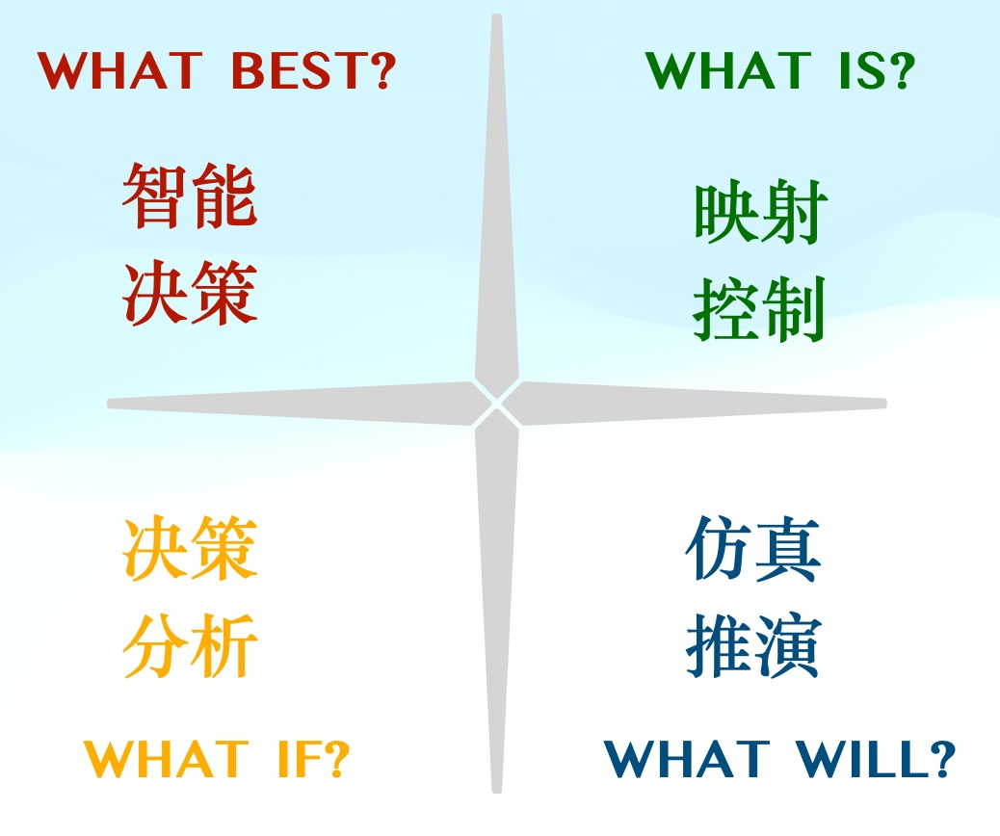

# 交通数字孪生核心能力

<figure><figcaption></figcaption></figure>

#### 2.1 孪生展示与反向控制

孪生展示指利用数字孪生技术将物理实体的映射为虚拟实体，以可视化方式呈现实体的运动状态。

在交通数字孪生领域，即通过多种数据采集手段获取动态、静态全交通要素，并将其精准映射至虚拟世界中，从而准确反应交通运行状态。交通孪生展示可分为实时展示与历史回放，前者可帮助交通管理者实时全面了解交通运行状态，后者可通过历史复现的方式帮助管理者进行根因分析等。

反向控制指利用数字孪生模型直接操控虚拟实体，并映射至物理实体，从而实现间接控制物理实体的运行。在交通数字孪生领域，管理者可基于实时交通运行状态，在虚拟空间中针对性的下达管控措施，如可变限速、车道封闭与开放等，并借助路侧声光电等设备传递至物理空间，从而间接控制交通运行。

#### 2.2 仿真推演

仿真推演指，利用数字孪生模型结合历史大数据，借助仿真的手段，从而实现预测物理实体的运行状态的过程。

预测可分为短期预测与长期预测，短期预测指基于当前交通运行状态，结合历史交通大数据及其他已知数据（如提前申报的运输路线、施工作业计划等），进行未来较短时间内的推演，从而帮助管理者提前预知未来一定时间内的状态变化。长期预测指借助历史大数据及其他已知数据，建立长期预测模型，推演未来较远时期的交通运行状态，从而帮助管理者明确远期未来的交通运行状态。

#### 2.3 决策分析

决策分析指，利用仿真推演的方式，对决策进行推演，并进一步基于推演结果分析决策的可行性与有效性。

与仿真推演对应，决策分析可支持短期与长期决策。短期决策分析常用于实时的应急决策（如救援路线等），可帮助管理者高效科学的制定紧急应对措施，赢得宝贵时间。长期决策分析则偏向于预案类，即可帮助管理者制定远期计划，如节假日大流量管控方案、恶劣天气管控预案、道路施工规划等，从而帮助管理者未雨绸缪，切实优化交通系统运行。

#### 2.4 智能决策

智能决策指数字孪生系统在预知未来的基础上，充分利用人工智能技术，基于仿真推演结果、历史观测、专家经验等数据，针对给定目标（如减少拥堵）进行半自主或自主决策，从而达到优化系统运行的目的。其中半自主决策即给出最优建议，由管理者决定执行与否，自主决策则无需人工介入。

完全自主的智能决策是数字孪生的高级形态，通过不断的映射、推演、决策、控制的循环，全面高效的优化交通系统运行状态，达到交通系统运行效率、安全系数最大化。
