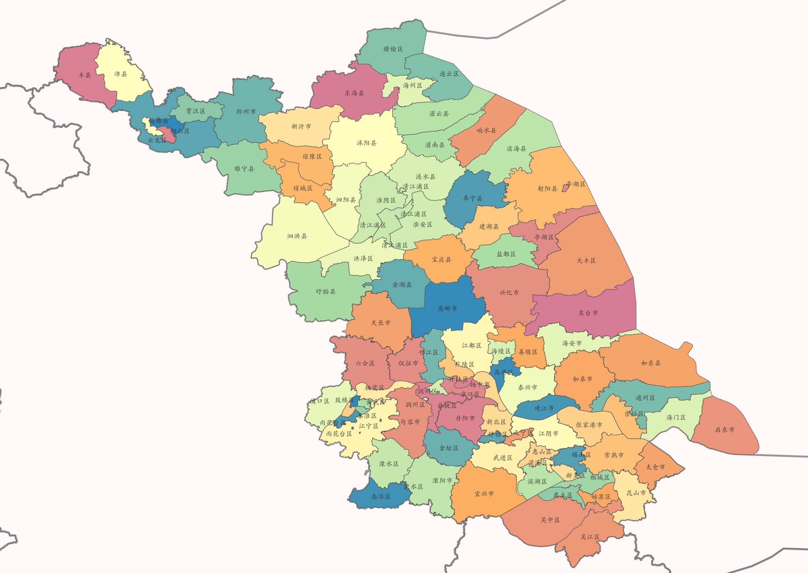

# 标精度地图

## 一、空间基础数据介绍

空间基础数据旨在通过原始数据采集、二次加工、持久化存储等系列流程，将海量地理空间对象数字化，形成全要素空间数据资产，其主要作用在于构建江苏高速数字底座，为智能交通上层业务提供支撑。

空间数据包含空间高速路网空间内静态要素的位置、属性，以及要素之间的各类空间关系，其中位置与属性需要过外业采集及内业加工方式获得，空间关系(如连通、包含等)可基于要素的位置与属性通过进一步研发相应的算法计算获得。

要素的位置信息是空间数据的核心信息，用于明确要素在地理空间中的所处位置，一般使用经纬度的方式进行记录与表述。从表现形式来看，空间位置主要有点 (点状要素，如门架、里程桩)、线(线状要素，如路线、路段)、多边形(面状要素，如行政区划、管辖范围等)三种类型。

要素的属性可分为自然属性与业务属性。自然属性以要素的地理、几何、物理等自然特性来定义，如设施的三维、区域面积等;业务属性基于实体的服务含义来定义，如设施的编号、路线上下行方向属性、收费路段编号等。

要素之间的连通关系是要素在拓扑空间的一种关系表达，在高速业务场景中，用于描述要素之间基于高速路网的的连通特性，通过相邻、可达、深度等属性来表述，如门架与其上/下游门架关系、与枢纽之间关系、与收费站/服务区关系，又如门架间可达路径的列举与最短路径的表示等。

要素之间的包含关系常用于聚合分析，如门架所属路线、路公司，路线所属路公司、所属行政区划等，根据不同维度的聚合，可支撑多层次多维度数据挖掘分析。

## 二、空间基础数据应用

空间数据是重要的基础数据，具有丰富的应用场景；在专题分析、空间算法服务、交通仿真与数字孪生、智能网联车路协同、地图服务及可视化等方面作为基础数据发挥重要作用。

专题分析方面，交通分析往往密切依赖空间基础数据，包括但不限于路网结构、观测设备位置、观测设备拓扑关系、服务区位置、收费站及枢纽的结构与位置等，在OD、在网车辆数、车辆密度、行程速度、驾驶里程、枢纽专题、空间聚类、拥堵热力等专题分析中起到重要支撑作用。

空间算法服务方面，空间基础数据为空间算法提供底层数据依赖，即空间算法服务是空间对象与算法的结合，如空间检索、路径规划、车辆轨迹提取与还原、车辆定位、电子围栏等算法，均是空间基础数据的算法应用。

交通仿真与数字孪生方面，空间基础数据是构建孪生可视化场景以及可计算路网模型的关键数据，此外精准的感知设备空间位置数据进一步确保动态交通要素正确的映射至数字孪生世界。

智能网联车路协同方面，一套统一无误的空间基础数据作为车与路共同的“参照系”，为感知、认知、决策、协调全链路提供全要素位置信息，从而辅助上层应用实现车辆与道路之间的协调配合，为实现车路协同打下坚实基础。

地图服务及可视化方面，空间基础数据可提供多类型、多维度的空间要素位置及属性信息，同时，多空间颗粒度层级设计，进一步保障可视化渲染的性能。

## 三、空间基础数据结构

空间基础数据涉及数据种类繁多，为有效组织管理，需对其按业务与属性进行分类管理。在 GIS系统中，空间对象的类型可基于几何形状分为：点(point)、线 (polyline)、多边形(polygon)。从高速公路业务角度考虑空间数据可分为：底图基础数据、道路设施、路侧设施、虚拟设施、拓扑关系、空间关系六大类型。 为满足各类业务、算法的需求，下面对空间基础数据进行解构与梳理，以便更好地理解和管理空间数据。本章共计规划 6 大类约 70 项空间数据，并给出命名规约，具体内容如下。

### 底图基础数据

底图基础类数据是指与高速业务关联性较弱通常作为底图使用的基础数据。通常又可细分为：行政区划、管辖边界、河流水体、土地类型等子项。底图基础数据应包含以下基本表数据:

* base\_prov 全国各省范围
* base\_city 全国各市范围
* base\_distr 全国各区范围
* base\_road\_co 路公司管辖范围
* base\_road\_center 分中心管理处管辖范围&#x20;
* base\_police 交警管辖范围
* base\_road\_admin 路政管辖范围
* base\_obstacle\_rm 排障大队管辖范围&#x20;
* base\_roadline 各条高速路线范围
* base\_water 全国水体底图
* road\_hw\_intvl\_X 基于各类设施的路网区间

<figure><figcaption>
江苏行政区划示意图
</figcaption></figure>

<figure><figcaption>
江苏水体示意图
</figcaption></figure>

### 道路

道路设施数据指依据不同业务需求，从各维度各粒度描述道路空间位置、属性、规则的数据集合，道路数据通常使用线、线串形式表述。道路设施数据应包含以下基本表数据:

* road\_hw\_baseline 高速路网道路(路基)中心线
* road\_hw 高速路网道路路线
* road\_hw\_line 高速路线(由高速路网道路路线根据一定规则合并而来)
* road\_hw\_info 高速相关属性信息

### 路侧设施

路侧设施指附着在道路两侧的道路可见附属设施，包括门架、摄像头、里程桩、 情报板等，与业务应用较为密切，是空间基础数据的基本构成要素。路侧设施在空间数据库中应包含以下基本表数据:

* fac\_hw\_gtr 高速门架
* fac\_hw\_gtr\_inter 高速边界门架，包括省界门架与市界门架
* fac\_hw\_gtr\_sa 高速服务区门架
* fac\_hw\_ts 高速收费站
* fac\_hw\_ts\_io 高速收费站出入，即将收费站出入口作为单独对象
* fac\_hw\_sa 高速服务区
* fac\_hw\_intchg 高速枢纽
* fac\_hw\_camera 高速摄像头
* fac\_hw\_mileage 高速里程桩
* fac\_hw\_gas\_station 高速加油站
* fac\_hw\_info\_plate 高速情报板
* fac\_hw\_alert 高速声光电告警设备
* fac\_hw\_indicator 高速指示牌
* fac\_hw\_traffic\_light 高速信号灯&#x20;
* fac\_hw\_billboard 高速广告牌

###

### 虚拟设施

虚拟设施指不具备物理形态但具有应用价值的抽象概念对象。其一般不直接用于业务使用，而是作为空间算法依赖数据，结合其他数据为上层应用提供支撑。虚拟设施数据在空间数据库中应包含以下基本表数据:

* vir\_hw\_traffic\_survey 高速交通调查点
* vir\_hw\_intchg\_cp 高速枢纽中心点，即枢纽空间范围的几何中心点
* vir\_hw\_intchg\_div 高速枢纽分流点，即车辆离开主线的点
* vir\_hw\_intchg\_con 高速枢纽合流点，即车辆汇入主线的点
* vir\_hw\_ts\_cp 高速收费站中心点
* vir\_hw\_ts\_io\_cp 高速收费站出入中心点
* vir\_hw\_ts\_div 高速收费站分流点
* vir\_hw\_ts\_con 高速收费站合流点
* vir\_hw\_sa\_cp 高速服务区中心点
* vir\_hw\_sa\_div 高速服务区分流点
* vir\_hw\_sa\_con 高速服务区合流点

### 拓扑关系

拓扑关系是一类抽象的空间数据，用于表达空间中具有实体或虚拟位置属性的设施之间的连通性关系，通常用可连通、不可连通、相邻、深度等属性表述。拓扑关系数据在空间数据库中应包含以下基本表数据:

* topo\_hw\_X\_adj 各类设施邻接关系
* topo\_hw\_X\_dep 各类设施可达深度关系
* topo\_hw\_edges 路网拓扑边
* topo\_hw\_vertices 路网拓扑顶点
* topo\_hw\_fac\_mapping 拓扑顶点与设施映射关系

### 空间关系

与拓扑关系类似的，空间关系也是一类抽象的空间数据，用于表达不同空间对象间的包含、被包含、相邻等位置关系。空间关系数据在空间数据库中应包含以下基本表数据:

* rel\_prov\_od 各省 OD 关系，用于省级流量 OD 分析可视化展示&#x20;
* rel\_city\_od 各市 OD 关系，用于城市级流量 OD 分析可视化展示
* rel\_distr\_od 各区 OD 关系，用于区级流量 OD 分析可视化展示
* rel\_ts\_od 各收费站 OD 关系，用于收费站级流量 OD 分析可视化展示
* rel\_intchg\_intvl\_od 各枢纽区间 OD 关系，用于枢纽区间级流量 OD 分析可视化展示
* rel\_gtr\_partial\_od 门架局部 OD 关系，用于门架级流量 OD 分析可 视化展示
* rel\_area\_fac 各空间范围与路侧设施关系，主要指路侧设施与各空间范围的包含关系
* rel\_intvl\_fac 各路网区间与路侧设施关系，主要指路侧设施与各路网区间的包含关系

